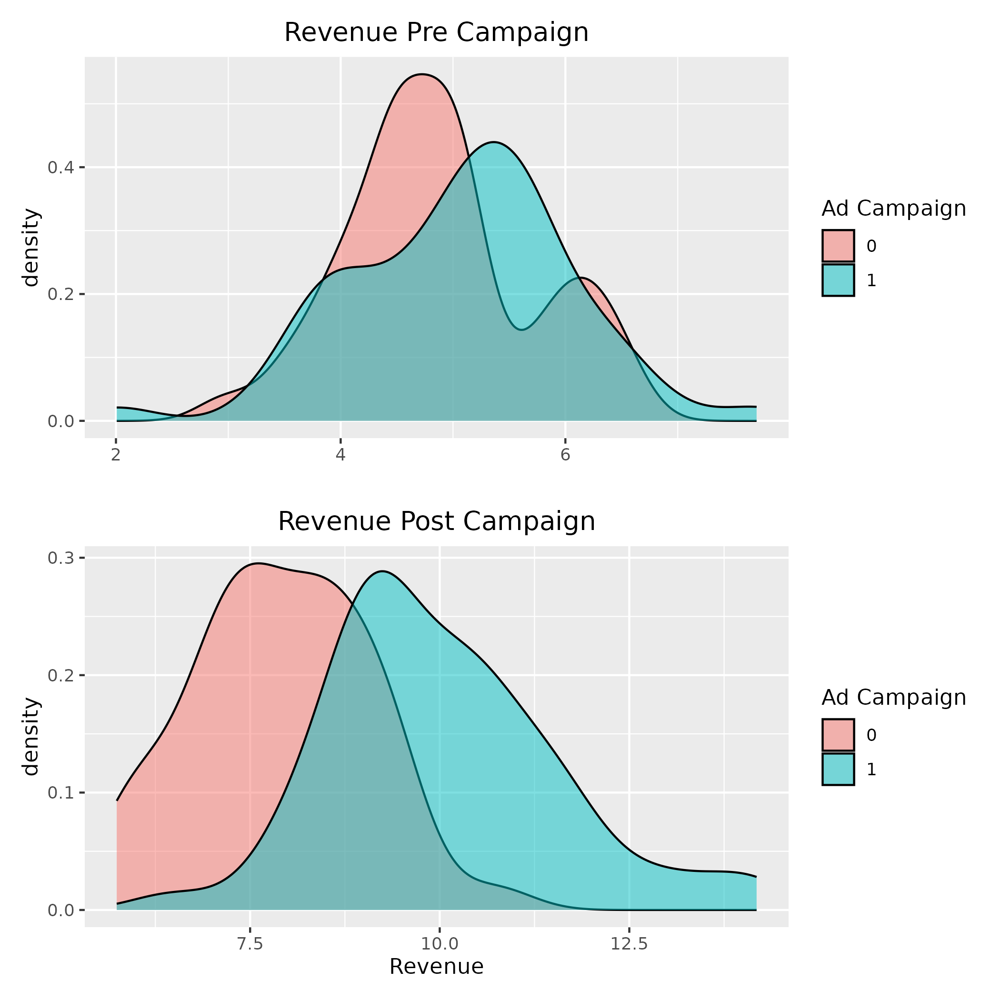

# Bayesian CUPED

The following repo is small R based analysis proeject heavily inspired by [Matteo Courthoud](https://github.com/matteocourthoud/Blog-Posts/blob/main/notebooks/cuped.ipynb) and [Juan Orduz](https://juanitorduz.github.io/bayesian_cuped/). Specifically here is demonstration of the value of the causal inference method of CUPED (Controlled-Experiment using Pre-Experiment Data) that is finding paricular use in industry enviroments Xie & Aurisset (2016).

From both the standardly applied Ordinary least square methods and a Bayesian CUPED model implmented using the Stan probabalistic progaming language.

The analysis example here is a based around a simulated data set for Marketing company running an ad campaign and wanting to run A/B test to estimate the impact of the ad campaign on company revenue. The big difference here in this simulated example that with have observed users revenue in the treatment (Served the ad) and the control (not ad campain) pre-exposure.  



# Standard model (OLS)
```{r}
d <- generate_data

# Statistical calculations. ----
diff_mean <- mean(d[d$ad_campaign==1,"revenue1" ]) - mean(d[d$ad_campaign==0,"revenue1" ])  
diff_mean

# The same can be achieved using ols lnear model.
ols_fit <- lm(revenue1 ~ ad_campaign ,data = d)
summary(ols_fit)
```
# Bayesian Model

# References

Carpenter, B., Gelman, A., Hoffman, M. D., Lee, D., Goodrich, B., Betancourt, M., ... & Riddell, A. (2017). Stan: A probabilistic programming language. Journal of statistical software, 76.

Deng, A., Xu, Y., Kohavi, R., & Walker, T. (2013, February). Improving the sensitivity of online controlled experiments by utilizing pre-experiment data. In Proceedings of the sixth ACM international conference on Web search and data mining (pp. 123-132).

Xie, H., & Aurisset, J. (2016, August). Improving the sensitivity of online controlled experiments: Case studies at netflix. In Proceedings of the 22nd ACM SIGKDD International Conference on Knowledge Discovery and Data Mining (pp. 645-654).